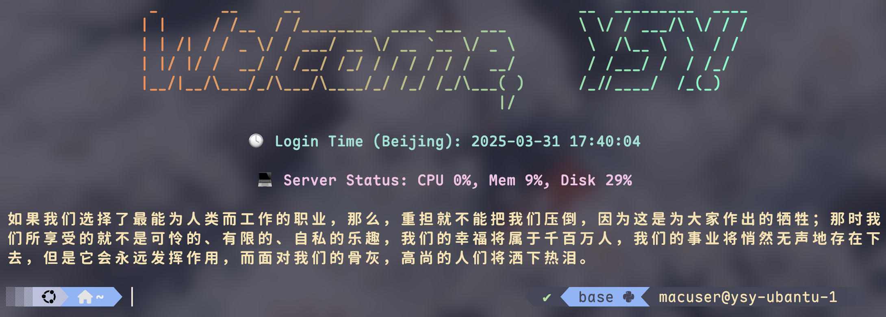

# 用于通过SSH远程登陆服务器时在终端上显示欢迎词

效果如图所示。



**注意依赖项：** `pip install rich pyfiglet psutil` ；  
注意环境，这里用的是 `lab` ；  
注意改脚本中你的名字。  

调用时需在shell的配置文件中`~/.zshrc`中加入类似以下内容（**注意路径**）：
```[zsh]
# === Welcome script on SSH login ===
if [ -n "$SSH_CONNECTION" ]; then
    source ~/miniconda3/etc/profile.d/conda.sh
    conda activate lab
    python ~/.welcome_screen/welcome_screen.py
fi
```